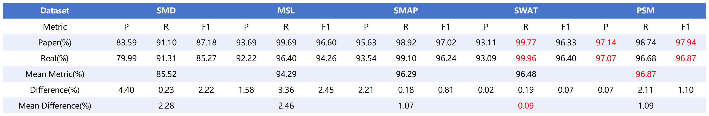

# KPI-anomaly-detection-model-based-on-transformer
 
## 1. Baseline Model Performance (DCdetector)

The results regarding the local reproduction of the thesis results are shown in the following table.

It can be seen that the local reproduction results are almost identical to those in the paper and that the algorithm performs best on the PSM dataset in aggregate.

## 2. Reference

DCdetector: https://github.com/DAMO-DI-ML/KDD2023-DCdetector
