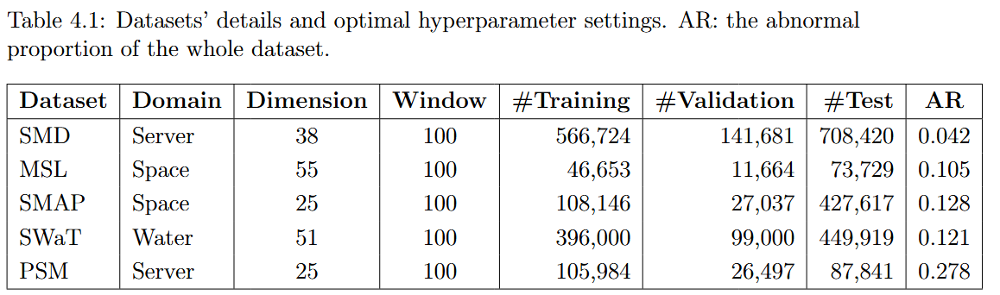
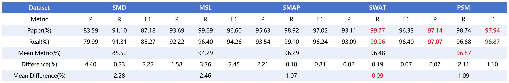
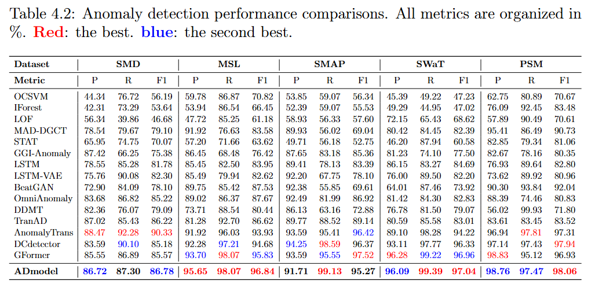
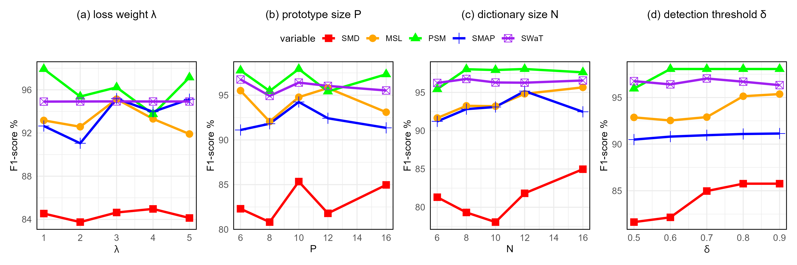
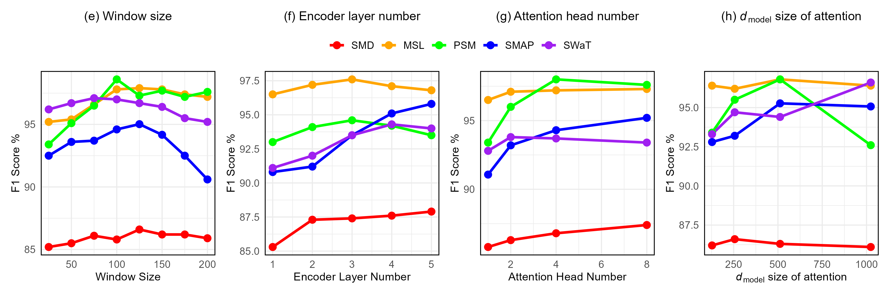
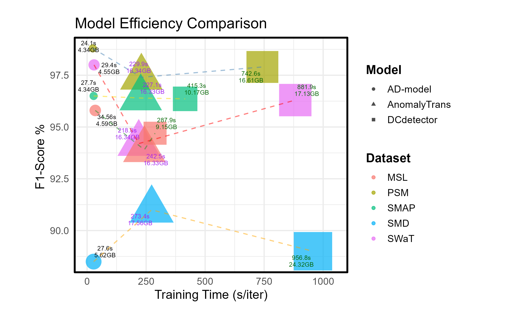

# AD-model(Anomaly-detection model) Developed and improved based on the GDformer

(GDformer: Going Beyond Subsequence Isolation for Multivariate Time Series Anomaly Detection)


## 1. Get Started--Environment configuration

 Install >= Python 3.6, PyTorch >= 1.4.0.

## 2. Datasets used
  Download data. You can obtain the benchmark datasets from the Github Repository of DCdetector ( [here](https://drive.google.com/drive/folders/1RaIJQ8esoWuhyphhmMaH-VCDh-WIluRR) ).

### 2.1 Datasets information:



## 3. Experiment results reproduce

**1.** Train and Test. We provide the experiment scripts of all benchmarks under the folder `./scripts`. You can reproduce the experiment results as follows:

```bash
bash ./scripts/SMD.sh
bash ./scripts/MSL.sh
bash ./scripts/SMAP.sh
bash ./scripts/SWaT.sh
bash ./scripts/PSM.sh
```
**2.** The following files record scripts used for hyperparameter fine-tuning

```bash
bash ./scripts/extra_test.sh
bash ./scripts/len_map.sh
bash ./scripts/num_proto.sh
```

## 4. Experiment results

### 4.1 Implementation Details


### 4.2 Evaluation Metrics


### 4.3 Baseline model

Based on the code provided in the paper [GD Former](https://arxiv.org/abs/2501.18196)[^1], we replicated the model on our own local device as our baseline model, with the results shown in the following table.



It can be seen that the baseline model results are almost identical to those in the paper and that the algorithm performs best on the PSM dataset in aggregate.

### 4.4 Main result



### 4.5.1 Parameter Sensitivity

Parameter Sensitivity 1-4:



Parameter Sensitivity 5-9:



### 4.5.2 Ablation Experiments


### 4.5.3 Model efficiency



## 5. Reference

> DCdetector: https://github.com/DAMO-DI-ML/KDD2023-DCdetector


[^1]: GDformer: https://github.com/yuppielqx/GDformer

........
